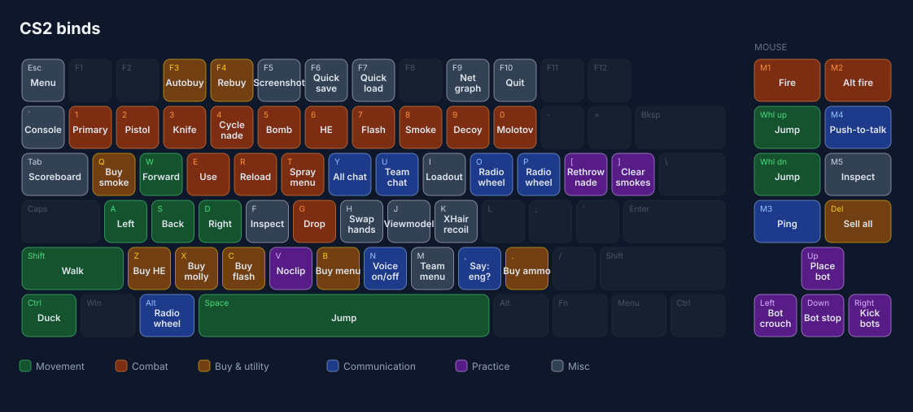

# CS2

Declarative CS2 configuration.

- `autoexec.cfg` — the complete bind set (defaults included) and settings; the single source of truth
- `practice.cfg` — practice server setup (`exec practice` in console)
- `render_binds.py` — generates the bind map below from `autoexec.cfg`

## Binds



The map is regenerated and staged by `.githooks/pre-commit` whenever `autoexec.cfg` or `render_binds.py` changes. One-time setup per clone:

```
git config core.hooksPath .githooks
```
