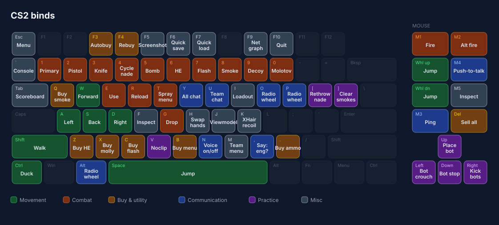

# CS2

Declarative CS2 configuration.

- `autoexec.cfg` — the complete bind set (defaults included) and settings; the single source of truth
- `practice.cfg` — practice server setup (`exec practice` in console)
- `render_binds.py` — generates the bind map below from `autoexec.cfg`

## Binds



The map is regenerated and staged by `.githooks/pre-commit` whenever `autoexec.cfg` or `render_binds.py` changes. See the root `README.md` for the hook setup.

The hook needs `python3` on `PATH`, and the system does not install it. Commit these changes in a nix shell:

```
nix shell nixpkgs#python3 --command git commit
```

Without `python3`, the commit fails and leaves `binds.svg` empty. Restore it with `git checkout home/cs2/binds.svg`.
